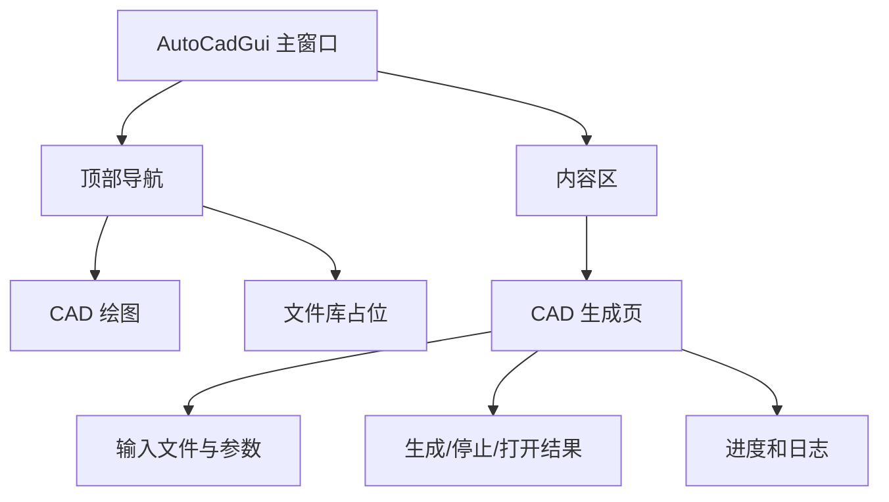

# 系统功能与工程结构

更新时间：2026-06-01

## 1. 当前功能

`auto_cad_gui` 是 `auto_cad` 的 Qt Widgets 前端，当前只保留 CAD 绘制相关界面。

| 功能 | 说明 |
| --- | --- |
| CAD 数据源选择 | 选择病害 Excel、板长 Excel、病害图例 DXF 和输出位置 |
| CAD 参数输入 | 配置绘图需要的里程、尺寸或生成参数 |
| 后端执行 | 通过 `QProcess` 启动 `draw_cad.exe` |
| 进度展示 | 展示生成状态、日志和错误 |
| 结果提示 | 生成完成后提示输出位置 |

## 2. 工程结构

| 文件或目录 | 说明 |
| --- | --- |
| `auto_cad_gui/AutoCadGui.h` | 主窗口声明和 CAD 页面成员 |
| `auto_cad_gui/AutoCadGui.cpp` | 主窗口布局、页面构建、信号槽和后端调用 |
| `auto_cad_gui/AntDesignStyle.*` | 主题样式和 QSS 工具 |
| `auto_cad_gui/AntButton.*` | 自定义按钮 |
| `auto_cad_gui/AnimatedProgressWidget.*` | 进度控件 |
| `auto_cad_gui/SvgIcon.*` | SVG 图标工具 |
| `auto_cad_gui/auto_cad_gui.vcxproj` | Qt GUI 工程 |
| `draw_cad.sln` | 包含 GUI 和后端的主解决方案 |

## 3. 界面结构



## 4. Qt 模块

当前工程使用：

```text
core;gui;widgets
```

GUI 不再依赖 Qt Network。

## 5. 与后端关系

| 项 | 说明 |
| --- | --- |
| 后端程序 | `draw_cad.exe` |
| 调用方式 | `QProcess` |
| 数据传递 | 文件路径和参数 |
| 结果传递 | 退出码、标准输出、标准错误、输出文件 |

标书/AI 后端已经迁出，不再由 `auto_cad_gui` 编译或调用。
