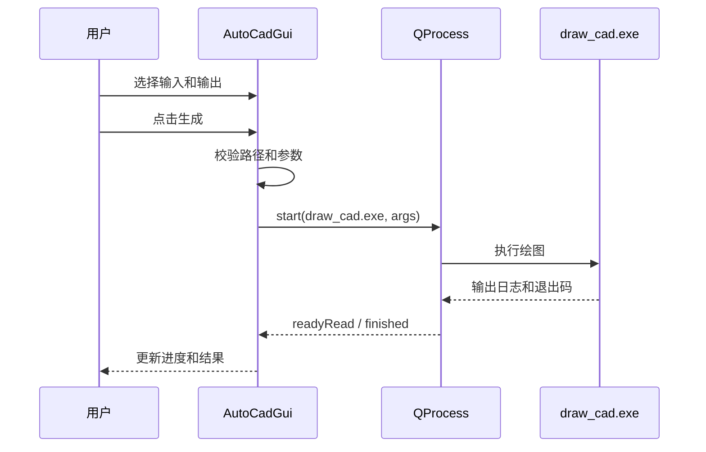

# 主窗口与 CAD 生成模块

更新时间：2026-06-01

## 1. 主窗口职责

`AutoCadGui` 当前是单一 CAD 工作台，负责：

| 职责 | 说明 |
| --- | --- |
| 组织窗口布局 | 顶部导航、内容区、状态区 |
| 构建 CAD 页面 | 数据源、参数、执行按钮、进度日志 |
| 选择本地文件 | Excel、DXF、输出目录或输出文件 |
| 调用绘图后端 | 启动 `draw_cad.exe` 并读取输出 |
| 展示结果 | 更新进度、日志、错误和完成提示 |

## 2. 导航状态

| 索引 | 页面 | 当前状态 |
| --- | --- | --- |
| 0 | CAD 绘图 | 当前唯一功能页面 |

`setActiveModule(0)` 用于激活 CAD 页面。文件库按钮保留为导航样式入口，但当前不对应独立业务页。

## 3. CAD 页面区域

| 区域 | 典型控件 | 说明 |
| --- | --- | --- |
| 数据源 | 路径输入框、浏览按钮 | 选择外观病害 Excel、板长 Excel、病害图例 DXF |
| 参数 | 输入框、下拉框或勾选项 | 配置 CAD 生成参数 |
| 操作 | 主按钮、次按钮 | 启动生成、停止进程、打开结果 |
| 进度 | `AnimatedProgressWidget`、状态文本 | 展示执行状态 |
| 日志 | 文本区域 | 展示后端输出和错误 |

## 4. 后端调用流程

## 5. 维护注意

1. 保持 GUI 参数和后端命令行参数同步。
2. 路径参数应作为独立参数传给 `QProcess`，避免空格或中文路径被拆坏。
3. 新增 CAD 页面控件后，同步更新信号槽、QSS 和控件索引。
4. 不再向 `AutoCadGui` 添加标书/AI 业务代码。
