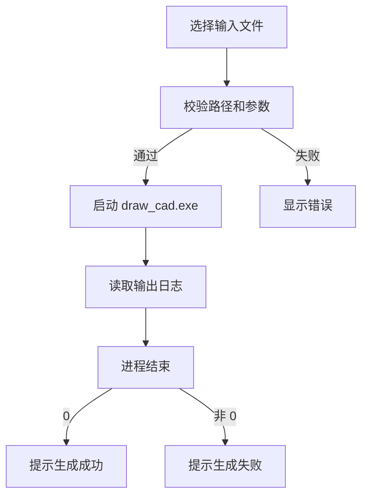

# 信号槽与交互逻辑

更新时间：2026-06-01

## 1. 当前信号槽范围

| 类别 | 触发对象 | 信号 | 槽/处理 | 结果 |
| --- | --- | --- | --- | --- |
| 导航 | CAD 导航按钮 | `clicked` | `setActiveModule(0)` | 激活 CAD 页面 |
| 文件选择 | 浏览按钮 | `clicked` | 文件选择处理函数 | 写入路径输入框 |
| CAD 生成 | 生成按钮 | `clicked` | 后端启动处理函数 | 校验参数并启动 `draw_cad.exe` |
| 后端输出 | `QProcess` | `readyReadStandardOutput` | 输出读取处理 | 更新日志和状态 |
| 后端错误 | `QProcess` | `readyReadStandardError` | 错误读取处理 | 更新错误日志 |
| 后端结束 | `QProcess` | `finished` | 完成处理 | 更新按钮、进度和结果 |

## 2. 交互流程

## 3. 状态管理

| 状态 | UI 表现 |
| --- | --- |
| 空闲 | 生成按钮可用，进度停留在初始状态 |
| 校验失败 | 保持空闲，展示错误信息 |
| 运行中 | 生成按钮禁用或切换为运行状态，进度控件启动 |
| 成功 | 展示输出路径和完成提示 |
| 失败 | 展示后端错误和排查建议 |

## 4. 维护注意

1. 新增 CAD 控件时，在同一页面构建区域完成 connect，便于追踪。
2. 后端进程结束后必须恢复按钮状态。
3. 错误信息应同时进入日志和用户可见状态文本。
4. 已迁出的标书/AI 信号槽不再出现在 `AutoCadGui` 中。
