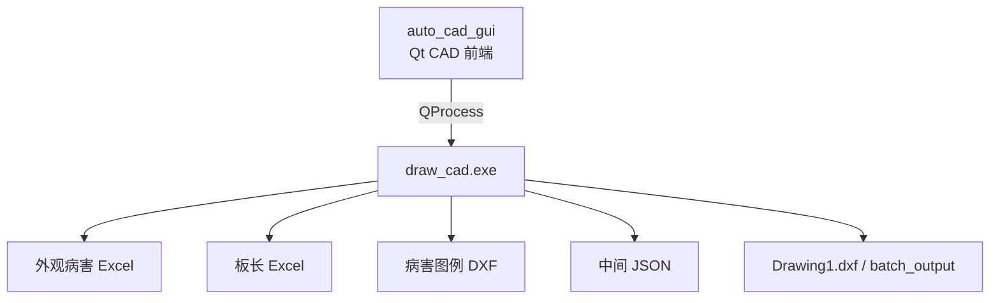
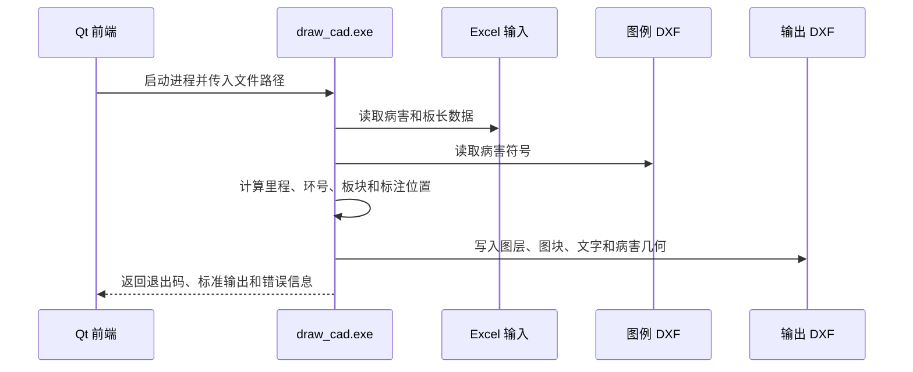

# 总体架构与关键流程

更新时间：2026-06-01

## 1. 当前架构

| 层级 | 目录或文件 | 职责 |
| --- | --- | --- |
| GUI 层 | `auto_cad_gui/*` | 文件选择、参数输入、进度展示、结果提示 |
| 命令行后端 | `draw_cad/main.cpp` | 参数解析、流程编排、错误返回 |
| 数据读取 | `draw_cad/*xlsx*`、相关解析类 | 读取病害和板长 Excel |
| CAD 生成 | `draw_cad/*dxf*`、绘图相关类 | 组织图层、图块、文字、线型和输出 |
| 测试脚本 | `tests/*.ps1` | 检查工程结构和关键 CAD 逻辑 |

## 2. CAD 生成主流程

## 3. GUI 与后端边界

| 边界 | 说明 |
| --- | --- |
| 调用方式 | GUI 不直接链接绘图业务类，主要通过 `QProcess` 调用 `draw_cad.exe` |
| 参数来源 | 用户在 GUI 中选择 Excel、DXF、输出目录和绘图参数 |
| 状态反馈 | GUI 读取后端标准输出、标准错误和进程退出码 |
| 失败处理 | GUI 将后端错误展示为运行日志、状态文本或弹窗 |

## 4. 工程边界

`draw_cad.sln` 当前包含两个项目：

| 项目 | 类型 | 说明 |
| --- | --- | --- |
| `draw_cad` | C++ 命令行程序 | CAD 绘图后端 |
| `auto_cad_gui` | Qt Widgets 程序 | CAD 前端 |

标书/AI 后端不在该解决方案中编译。
